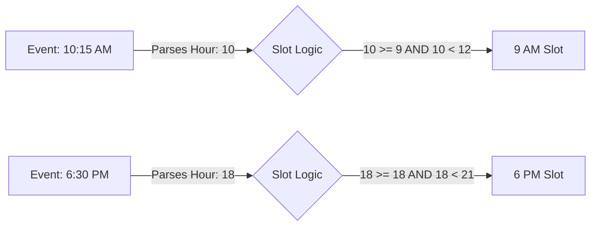

# Calendar Frontend Documentation

## 1. Project Overview
This project is a comprehensive **Class Scheduling System** built with **Next.js** and **TypeScript**. It features a robust calendar interface allowing users to schedule, manage, and view classes with support for complex recurrence patterns (daily, weekly, monthly, custom).

## 2. Technology Stack

### Core Framework
- **Next.js**: The React framework used for structure, routing, and rendering.
- **TypeScript**: Ensures type safety across the application, especially for complex calendar event structures.

### Styling & UI
- **Tailwind CSS**: Utility-first CSS framework used for all styling.
- **Shadcn UI**: A collection of reusable components (Dialogs, Selects, Buttons) built on **Radix UI** primitives, ensuring accessibility and consistent design.
- **Lucide React**: The icon library used throughout the application (e.g., `Calendar`, `Clock`, `User`).

### State Management & Data Fetching
- **@tanstack/react-query**: Handles server state, caching, and data synchronization. Custom hooks in `hooks/useCalendarApi.ts` (e.g., `useDateRange`, `useClasses`) abstract the fetching logic.
- **Axios**: The HTTP client used to communicate with the backend API. Configured in `lib/api.ts` with interceptors for error handling and response transformation.

### Date Handling
- **date-fns**: The primary library for date manipulation. Used extensively for:
  - Calculating week/month start and end dates.
  - Formatting dates for display (e.g., "Mon, Jan 1st").
  - Comparing dates to determine if they are in the past or today.
  - Generating arrays of days for the calendar grid.

---

## 3. Calendar Architecture

The calendar functionality is split into two main view modes, handled by parent component `ClassSchedule.tsx`.

### A. Week View (`WeekView.tsx`)
- **Purpose**: Displays a 7-day grid with time slots to visualize overlaps and daily schedules.
- **Implementation**:
  - **Grid System**: Constructed using CSS Grid. Rows represent time slots (e.g., 6 AM, 9 AM), and columns represent days of the week.
  - **Performance**: Uses `useMemo` to group events by a key (`YYYY-MM-DD-Hour`) for **O(1) lookup time**. This prevents performance degradation when rendering many events.
  - **Event Cards**: Individual events are rendered as `WeekEventCard` components, handling their own status styling (Available/Cancelled/Completed) and hover effects.

### B. List View (`ListView.tsx`)
- **Purpose**: A detailed, linear list of upcoming classes, useful for scanning details.
- **Implementation**:
  - Groups events by their recurrence series where applicable.
  - Provides rich tooltips showing recurrence patterns.
  - Allows quick actions like status updates and deletion via a dropdown menu.

---

## 4. Visual Grid Structure & Time Slots

The Weekly Calendar is not a minute-by-minute timeline but a **Grid Matrix** divided into 3-hour chunks (buckets). This design choice simplifies the layout and makes it easier to read.

### Fixed Time Buckets
The day is divided into the following fixed intervals:

| Label in UI | Hour Key | Time Range Covered |
| :--- | :--- | :--- |
| **6 AM** | 6 | 06:00 - 08:59 |
| **9 AM** | 9 | 09:00 - 11:59 |
| **12 PM** | 12 | 12:00 - 14:59 |
| **3 PM** | 15 | 15:00 - 17:59 |
| **6 PM** | 18 | 18:00 - 20:59 |
| **9 PM** | 21 | 21:00 - End of Day |

### Rendering Logic
1. **Event Grouping**: Before rendering, the application loops through all events and groups them into a "Hash Map" using a unique key: `YYYY-MM-DD-Hour`.
   - *Example*: An event at **10:15 AM** is assigned to the **9 AM** bucket key.
   - *Example*: An event at **1:30 PM** (13:30) is assigned to the **12 PM** bucket key.
2. **Grid Iteration**: The component iterates through the defined buckets (rows) and days (columns).
3. **Lookup**: For each cell (e.g., Tuesday at 9 AM), it performs an **O(1)** lookup in the hash map to see if any events exist for that specific bucket.



---

## 5. Recurrence Definitions

Time slots are the core data structure defining when classes occur. They are handled dynamically based on the **Recurrence Type** selected in `CreateClassModal.tsx` and `EditClassModal.tsx`.

### Recurrence Logic

#### 1. One-Time Class
- **Definition**: A single specific instance.
- **Data**: Has a single `scheduledDate`, `startTime`, and `endTime`.

#### 2. Daily Recurrence
- **UI**: User defines a list of time slots that apply to **every day** within the date range.
- **Data Structure**:
  ```typescript
  dailyTimeSlots: [
    { startTime: "09:00", endTime: "10:00" },
    { startTime: "14:00", endTime: "15:00" }
  ]
  ```

#### 3. Weekly & Custom Recurrence
- **UI**: User selects specific days of the week (e.g., Mon, Wed, Fri) and assigns unique time slots to each selected day.
- **Data Structure**:
  ```typescript
  dayWiseTimeSlots: [
    { 
      day: "monday", 
      timeSlots: [{ startTime: "09:00", endTime: "10:00" }] 
    },
    { 
      day: "wednesday", 
      timeSlots: [{ startTime: "10:00", endTime: "11:30" }] 
    }
  ]
  ```

---

## 6. API Integration

The frontend communicates with the backend via the `lib/api.ts` module.

- **Endpoints**:
  - `GET /calander/calendar`: Unified view for the calendar grid.
  - `POST /calander`: Create new class series.
  - `PUT /calander/:id`: Update class definitions.
  - `PATCH /calander/:id/status`: Quickly toggle status (Scheduled/Cancelled/Completed).

---

